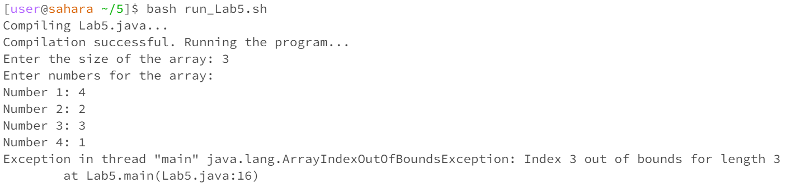
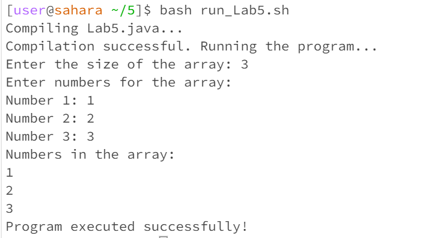
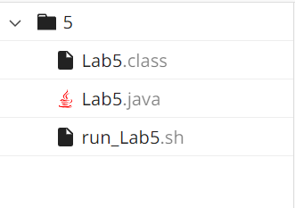

# Lab Report 5 - Putting it All Together

## Part 1 – Debugging Scenario

### Original Post from Student

*Subject:* **Help Needed: Array Index Out of Bounds Exception in Lab5 Program**


Hey everyone,

I've encountered an issue while working on my `Lab5` program. I'm trying to take user input for an array, but my program is taking 4 elements and it seems like there's an array index out of bounds exception. 

This is my error:


Here's the relevant code:

```java
for (int i = 0; i <= size; i++) {
    System.out.print("Number " + (i + 1) + ": ");
    numbers[i] = scanner.nextInt();
}
``````

### TA Response

*Subject:* **Re: Help Needed: Array Index Out of Bounds Exception - Suggestion**

Hey there,

Thanks for providing the code snippet. It looks like the loop condition might be causing the issue. Consider taking a closer look at the loop condition, especially regarding how it iterates over the array indices. Try to ensure that you stay within the bounds of the array. Let me know if this helps or if you have any questions about the loop condition!

### Student Follow-up

*Subject:* **Re: Re: Help Needed: Array Index Out of Bounds Exception - Issue Resolved!**


Hey,

I appreciate your suggestion! After adding a print statement inside the loop and carefully checking the values of `i` and `size`, I was able to identify the issue. It turns out I was incorrectly using `<=` in the loop condition. Here's the corrected code:

```java
for (int i = 0; i < size; i++) {
    System.out.print("Number " + (i + 1) + ": ");
    numbers[i] = scanner.nextInt();
}
```




File and Directory Structure


Original buggy java code
```
import java.util.Scanner;

public class Lab5 {
    public static void main(String[] args) {
        Scanner scanner = new Scanner(System.in);

        System.out.print("Enter the size of the array: ");
        int size = scanner.nextInt();

        int[] numbers = new int[size];

        System.out.println("Enter numbers for the array:");

        for (int i = 0; i <= size; i++) {
            System.out.print("Number " + (i + 1) + ": ");
            numbers[i] = scanner.nextInt();
        }

        System.out.println("Numbers in the array:");
        for (int i = 0; i < size; i++) {
            System.out.println(numbers[i]);
        }

        System.out.println("Program executed successfully!");
    }
}
```
Original bash script
```bash
#!/bin/bash

echo "Compiling Lab5.java..."
javac Lab5.java

if [ $? -eq 0 ]; then
    echo "Compilation successful. Running the program..."

    java Lab5
else
    echo "Compilation failed. Please check Lab5.java for errors."
fi
```
Command lines to trigger the bug
```
cd 5
javac Lab5.java
bash run_Lab5.sh
```

The bug was the use of '<=' instead of '<' in the loop condition. This caused the program to prompt the user for an extra element that it was unable to access as its index was out of bounds.

# Part 2
I thought that something really cool was using vim. It had been something I heard my friends who had taken CSE 30 complained about and everything I heard about it was negative. It was daunting but really exciting for me to get to use it for the first time. While it was confusing, it was a lot better than I thought it would be. It made me a bit uncomfortable but I found that navigating the editor came quite intuitively to me.